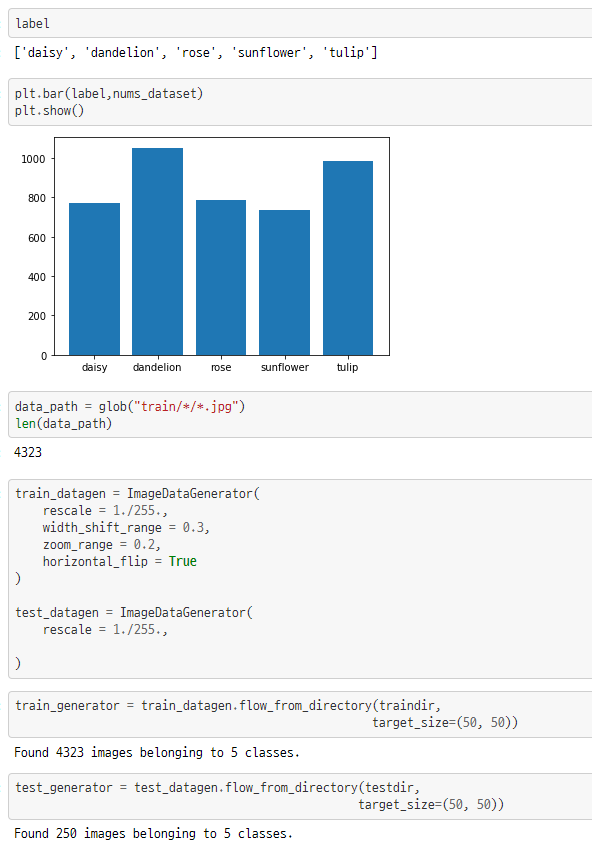
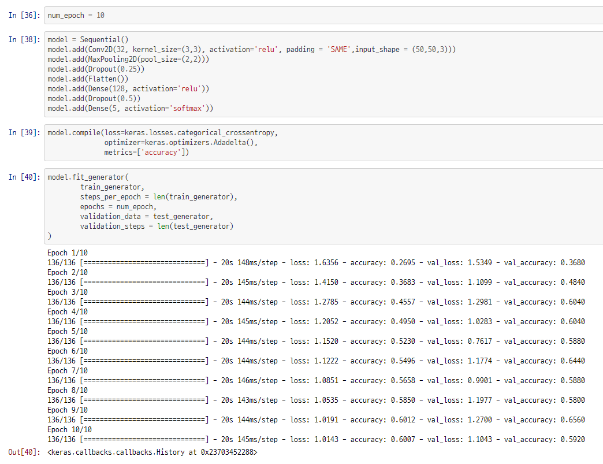
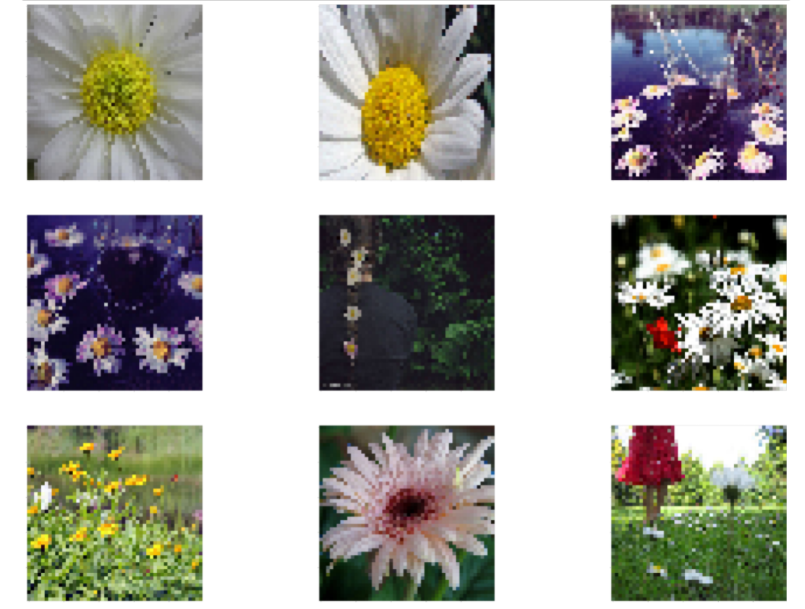

# :books: Deeplearning project

## 개요

- 사용언어 : `Python`
- 작업툴 : `Jupyter Notebook`, `Google Colab`
- 사용 라이브러리 : `pandas`, `numpy`, `matplotlib`, `tensorflow`,`keras`
- 인원 : 1명
- 기간 : 2020.07 - 2020.08
- 내용 : 머신러닝과 딥러닝 수강중 기말 고사 대체 프로젝트 과제로 CNN을 활용한 꽃 분류 프로그램을 구현

## 프로젝트 진행

- Kaggle에서 Dataset을 찾아 다운로드
  - https://www.kaggle.com/imsparsh/flowers-dataset
- 이미지 전처리 및 데이터 확인
  - 
- CNN을 이용한 데이터 학습
  - 
  - epoch 수를 늘려 정확도 향상 가능
  - keras의 Conv2D와 MaxPooling2D를 이용
  - 활성함수로 relu를 사용하였고 마지막에는 가장 높은 확률을 가진 대상을 찾기 위해 softmax 함수를 사용
  - 중간중간 Dropout과 평탄화를 통해 조절

## 결과

- 분류된 결과 사진

