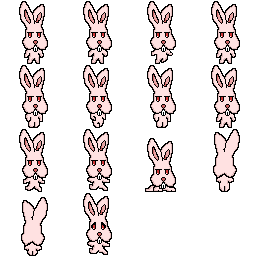
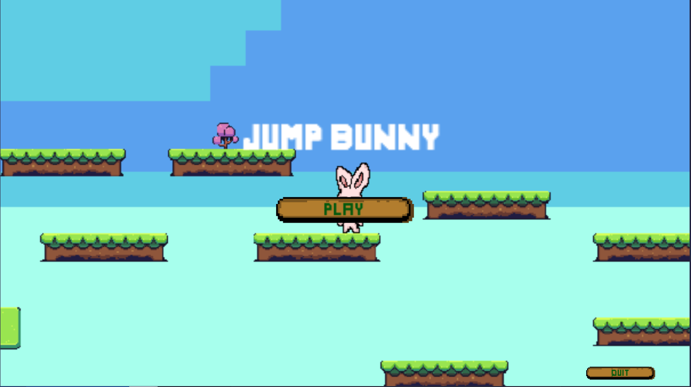
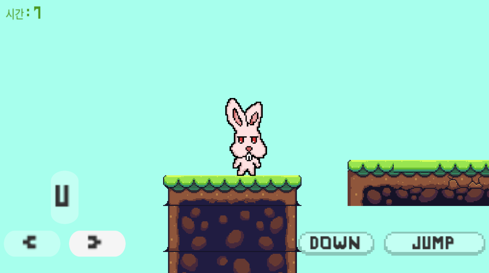

# :rabbit: Jump Bunny


## 개요

### 🔰Unity 활용 게임만들기

- 사용언어 : `C#`, `C++`
- 작업툴 : `Unity`
- 인원 : 1명
- 기간 : 2020.08 - 2020.08
- 내용 : 
  - Unity를 활용한 간단한 플랫포머 게임 제작
  - 게임 구상
  - 영상 자료들을 참고하며 기본적인 로직(이동, 점프 등) 구현
  - Pixel art 제작 사이트를 통해 직접 캐릭터 디자인 및 제작
  - 엎드리기, 사다리 오르기 등 심화 로직 구현
  - 친구들 플레이 결과 꽤나 만족스러운 반응
- 목적 : C# 공부 겸 한번쯤은 만들어 보고 싶었던 게임을 만들어 보고 싶었기 때문

## 프로젝트 진행

- 유튜버 [골드메탈](https://www.youtube.com/channel/UCw_N-Q_eYJo-IJFbNkhiYDA)님의 강의를 보며 진행

- 도트를 찍어 직접 캐릭터를 만들었고 디자인의 중요성을 깨달음

  - 

- 각각의 기능 C#으로 구현

  - Down.cs

    - ```c#
      using System.Collections;
      using System.Collections.Generic;
      using UnityEngine;
      
      public class Down : MonoBehaviour
      {
          Animator anim;
          void Start()
          {
          anim = GameObject.Find("anim").GetComponent<Animator>();
          }
      
          // Update is called once per frame
          void FixedUpdate()
          {
             
          }
      
          void OnCollisionEnter2D(Collision2D Get)
          {
              if (Get.gameObject.layer.Equals("Platform"))
              {
                  anim.SetBool("isJumping", false);
              }
          }
      }
      ```

  - EnemyMove(오타로 Moce가 됨...)

    - ```c#
      using System.Collections;
      using System.Collections.Generic;
      using UnityEngine;
      
      public class EnemyMoce : MonoBehaviour
      {
          
          Vector2 pos;
          public float delta;
          public float speed;
          // Start is called before the first frame update
          void Start()
          {
              
              pos = transform.position;
          }
      
          // Update is called once per frame
          void Update()
          {
              Vector2 v = pos;
              v.x += delta * Mathf.Sin(Time.time * speed);
              transform.position = v;
      
          }
         
      }
      © 2021 GitHub, Inc.
      ```

  - GameManager.cs

    - ```c#
      using System.Collections;
      using System.Collections.Generic;
      using UnityEngine;
      using UnityEngine.UI;
      using UnityEngine.SceneManagement;
      
      public class Gamemanager : MonoBehaviour
      {
          public float totalTime;
          public Text text_Timer;
          public PlayerMove player;
          public GameObject[] stages;
          public GameObject RestartBut;
          Vector3 StartingPos;
          Quaternion StartingRotate;
          static bool isStarted = false;
          static bool isEnded=false;
          bool isPaused = false;
          public GameObject[] P_button;
          // Start is called before the first frame update
      
           void Awake()
           {
              Time.timeScale = 0f;
      
          }
      
          
             
              
          
      
          
          // Update is called once per frame
          void Update()
          {
              totalTime += Time.deltaTime;
              text_Timer.text = "시간 : " + Mathf.Round(totalTime);
          }
      
          void Start()
          {
              if (!isStarted)
              {
                  SceneManager.LoadScene("First_s", LoadSceneMode.Single);
              }
              StartingPos = GameObject.FindGameObjectWithTag("start").transform.position;
              StartingRotate = GameObject.FindGameObjectWithTag("start").transform.rotation;
              Time.timeScale = 1f;
      
          }
      
          void OnTriggerEnter2D(Collider2D collision)
          {
          if(collision.gameObject.tag == "Player")
              {
                  collision.attachedRigidbody.velocity = Vector2.zero;
                  collision.transform.position = new Vector3(0, 4, -1);
              }        
          }
      
         public void StartGame()
          {
              
              Time.timeScale = 1f;
      
              GameObject standingCamera = GameObject.FindGameObjectWithTag("MainCamera");
              standingCamera.SetActive(false);
      
              StartingPos = new Vector3(StartingPos.x, StartingPos.y + 2f, StartingPos.z);
              Instantiate(player, StartingPos, StartingRotate);
      
              
          }
      
          public static void EndGame()
          {
      
              Time.timeScale = 0f;
              isEnded = true;
          }
      
          public static void StartMenu()
          {
              isStarted = true;
              SceneManager.LoadScene("m_Play", LoadSceneMode.Single);
      
          }
      }
      ```

  - PlayerMove

    - ```c#
      using JetBrains.Annotations;
      using System.Collections;
      using System.Collections.Generic;
      using UnityEngine;
      using UnityEngine.UI;
      
      public class PlayerMove : MonoBehaviour
      {
          public AudioClip audioJump;
          public AudioClip audioDamaged;
          public AudioClip audioFinish;
          public Gamemanager gamemanager;
          public float W, H_s,H_b, X, Y_b,Y_b_s;
          public float maxSpeed;
          public float UpSpeed;
          public float Xspeed;
          public bool Aspect;
          public float JumpPower;
          private bool m_ladder;
          private bool inputJump = false;
          private bool inputDown = false;
          private bool But_on = false;
      
      
          Rigidbody2D rigid;
          SpriteRenderer spriteRenderer;
          Animator anim;
          BoxCollider2D  PlayerBox;
            
          AudioSource adS;
          
      
          void Start()
          {
              rigid = GetComponent<Rigidbody2D>();
              spriteRenderer = GetComponent<SpriteRenderer>();
              anim = GetComponent<Animator>();
              m_ladder = false;
              PlayerBox = GetComponent<BoxCollider2D>();
              
              adS = GetComponent<AudioSource>();
          }
      
          void Playsound(string action)
          {
              switch (action)
              {
                  case "JUMP":
                      adS.clip = audioJump;
                      adS.Play();
                      break;
                  case "DAMAGED":
                      adS.clip = audioDamaged;
                      adS.Play();
                      break;
                  case "FINISH":
                      adS.clip = audioFinish;
                      adS.Play();
                      break;
              }
          }
          void Update()
          {
              //Jump
              if (inputJump&& !anim.GetBool("isJumping")) {
                  rigid.AddForce(Vector2.up * JumpPower, ForceMode2D.Impulse);
                  anim.SetBool("isJumping", true);
                  Playsound("JUMP");
                  
              }
      
              //Stop Speed 
              if (!But_on)
              {
                  rigid.velocity = new Vector2(0, rigid.velocity.y);
              }
              //Direction Sprite
              
              spriteRenderer.flipX = !Aspect;
                 
              
              
      
      
              //animation
              if (rigid.velocity.normalized.x == 0)
                  anim.SetBool("isWalking", false);                                
      
              else
                  anim.SetBool("isWalking", true);
             
                  
      
          }
          void FixedUpdate()
          {
              //Move By Key Control
              float h = Xspeed;
              //Move speed
              rigid.AddForce(Vector2.right * h, ForceMode2D.Impulse);
              
      
              if (rigid.velocity.x > maxSpeed)
                  rigid.velocity = new Vector2(maxSpeed, rigid.velocity.y);
              else if (rigid.velocity.x < maxSpeed*(-1))
                  rigid.velocity = new Vector2(maxSpeed*(-1), rigid.velocity.y);
      
              //Landing Platform
              if(rigid.velocity.y < 0)
              {
                  Debug.DrawRay(rigid.position, Vector3.down, new Color(0, 1, 0));
                  RaycastHit2D rayHit = Physics2D.Raycast(rigid.position, Vector3.down, 1, LayerMask.GetMask("Platform"));
                  if (rayHit.collider != null)
                  {
                      if (rayHit.distance < 1.2f)
                          anim.SetBool("isJumping", false);
      
                  }
              }
              //Down
              if (inputDown&& !inputJump)
              {
                  anim.SetBool("isDown", true);
                  rigid.velocity = new Vector2(0, rigid.velocity.y);
                  if (PlayerBox != null)
                  {
                      PlayerBox.size = new Vector2(W, H_s);
                      PlayerBox.offset = new Vector2(X, Y_b_s);
                  }
              }
              else
                  anim.SetBool("isDown", false);
              if (!inputDown)
              {
                  anim.SetBool("isDown", false);
                  if (PlayerBox != null)
                  {
                      PlayerBox.size = new Vector2(W, H_b);
                      PlayerBox.offset = new Vector2(X, Y_b);
                  }
              }
              
      
      
      
              //Ladder
              float UpDown ;
              UpDown = UpSpeed;
              if (m_ladder)
              {
                  rigid.AddForce(Vector2.up * UpDown, ForceMode2D.Impulse);
                  
                  if (rigid.velocity.y > maxSpeed)
                      rigid.velocity = new Vector2(rigid.velocity.x, maxSpeed);
                  else if (rigid.velocity.y < maxSpeed * (-1))
                      rigid.velocity = new Vector2(rigid.velocity.x, maxSpeed*(-1));
              }
             
             
          }
      
          void OnTriggerEnter2D(Collider2D Get)
          {
              if (Get.gameObject.tag.Equals("Ladder"))
              {
                  if (!m_ladder)
                  {
                      m_ladder = true;
                      anim.SetBool("isLadder", true);
                      this.transform.Translate(0, 0.05f, 0);
                  }
              }
              
             if(Get.gameObject.tag.Equals("End"))
              {
                  //game clear
                  Gamemanager.EndGame();
                  Playsound("FINISH");
                  Time.timeScale = 0;
                 
      
              }
              
              
          }
      
          void OnTriggerExit2D(Collider2D Get)
          {
              if (Get.gameObject.tag.Equals("Ladder"))
              {
                  if (m_ladder)
                  {
                      m_ladder = false;
                      anim.SetBool("isLadder", false);
                  }
              }
          }
      
      
      
      
      
      
      
          void OnCollisionEnter2D(Collision2D collision)
          {
              if(collision.gameObject.tag == "enemy")
              {
                  OnDamaged(collision.transform.position);
              }
          }
      
          void OnDamaged(Vector2 targetPos)
          {
              //chage layer
              gameObject.layer = 14;
              //view alpha
              spriteRenderer.color = new Color(1, 1, 1, 0.4f);
              //reachtion force
              int dirc = transform.position.x - targetPos.x > 0 ? 1 : -1;
              rigid.AddForce(new Vector2(dirc, 1)*3, ForceMode2D.Impulse);
              //animation
              anim.SetTrigger("doDamaged");
              Playsound("DAMAGED");
              Invoke("OffDamaged", 0.7f);
              
      
          }
      
          void OffDamaged()
          {
              gameObject.layer = 9;
              spriteRenderer.color = new Color(1, 1, 1, 1);
          }
      
          public void JumpDown()
          {
              inputJump = true;
          }
          public void JumpUp()
          {
              inputJump = false;
          }
          public void Down_Up()
          {
              inputDown = false;
          }
          public void Down_Down()
          {
              inputDown = true;
          }
      
          public void Up_Down()
          {
             
              UpSpeed += 0.5f;
          }
          public void Up_Up()
          {
              
              UpSpeed -= 0.5f;
          }
      
          public void Right_Down()
          {
              But_on = true;
              Xspeed += 0.5f;
              Aspect = true;
          }
          public void Right_Up()
          {
              But_on = false;
              Xspeed -= 0.5f;
          }
          public void Left_Down()
          {
              But_on = true;
              Xspeed -= 0.5f;
              Aspect = false;
          }
          public void Left_Up()
          {
              But_on = false;
              Xspeed += 0.5f;
          }
      }
      ```

  - Quitbutton

    - ```c#
        
      using System.Collections;
      using System.Collections.Generic;
      using UnityEngine;
      
      public class Quitbutton : MonoBehaviour
      {
          // Start is called before the first frame update
          void Start()
          {
              
          }
      
          // Update is called once per frame
         public void Quit_b()
          {
              Application.Quit();
          }
      }
      ```

  - StartGameButton

    - ```c#
      using System.Collections;
      using System.Collections.Generic;
      using UnityEngine;
      using UnityEngine.SceneManagement;
      
      public class StartGameButton : MonoBehaviour
      {
          
          // Start is called before the first frame update
          void Start()
          {
              
          }
      
          public void OnMouseUpAsButton()
          {
              Gamemanager.StartMenu();
              
          }
          
      }
      ```

## 결과

- apk 파일 제작
- 친구들에게 플레이 시킨 결과 나쁘지 않은 반응





