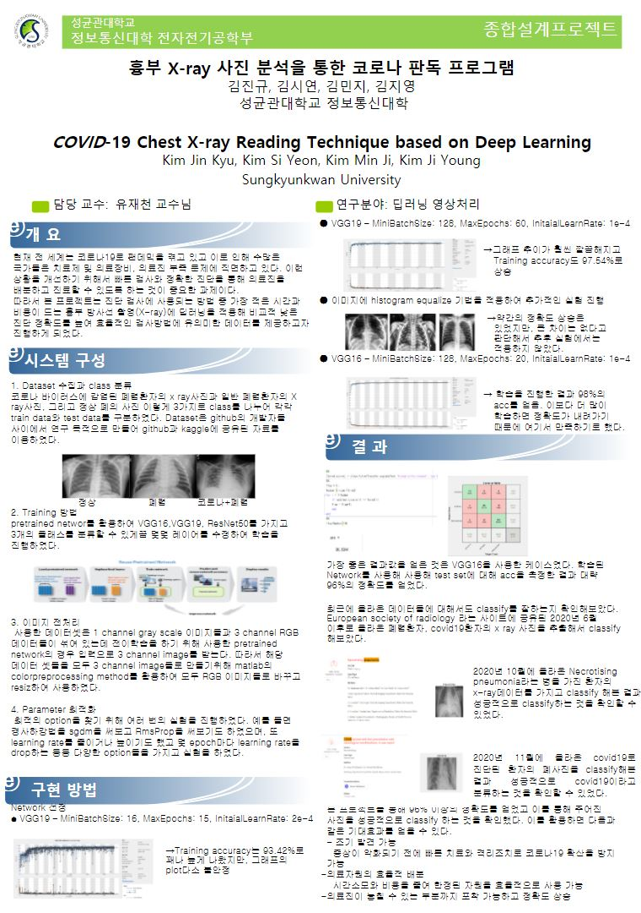
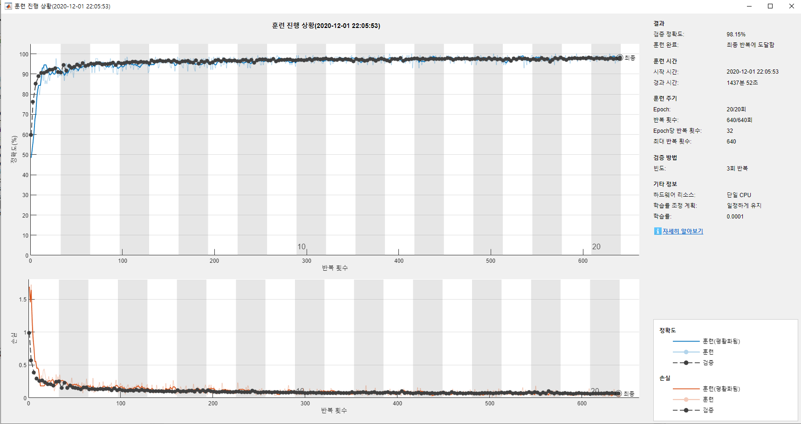
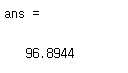

# :mortar_board: 종합설계프로젝트


## 개요

### 🔰종합설계프로젝트

- 사용언어 : `Matlab`
- 작업툴 : `Matlab`
- 역할 : 팀장
- 인원 : 4명
- 기간 : 2020.10 - 2020.12
- 내용 :
  - Matlab을 활용한 Deeplearning 프로젝트 진행
  - 흉부 X-ray 사진을 이용한 코로나 폐렴 정상 상태 판독 프로그램 구현

## 프로젝트 진행

- kaggle에서 Dataset 검색

  - https://www.kaggle.com/prashant268/chest-xray-covid19-pneumonia

- Matlab 내부의 vgg16 network를 다운받고 net에 저장

  - ```matlab
    %%
    net = vgg16() ;
    
    %analyzeNetwork(net); -> Network 분석을 위한 코드
    ```

- 이미지 불러오기

  - ```matlab
    %%
    imds = imageDatastore('Data\train',...
        'IncludeSubfolders',true,...
        'LabelSource','foldernames');
    ```

- 랜덤하게 8:2의 비율로 Train set과 Validation set 나누기

  - ```matlab
    %%
    [imdsTrain,imdsValidation] = splitEachLabel(imds,0.8,'randomized')
    ```

- Transfer Learning을 위한 설정

  - ```matlab
    %%
    inputSize = net.Layers(1).InputSize
    
    layersTransfer = net.Layers(1:end-3);
    
    numClasses = numel(categories(imdsTrain.Labels))
    ```

- Transfer Learning을 위해 제거한 만큼 필요한 계층을 쌓기

  - ```matlab
    %%
    layers = [
        layersTransfer
        fullyConnectedLayer(numClasses,'WeightLearnRateFactor',20,'BiasLearnRateFactor',20)
        softmaxLayer
        classificationLayer];
        
    analyzeNetwork(layers); % => 잘 쌓아졌나 확인
    ```

- 이미지 전처리를 해주고 gray scale에서 RGB로 변경 => 기존의 네트워크가 RGB 입력을 받기 때문

  - ```matlab
    %%
    pixelRange = [-30 30];
    imageAugmenter = imageDataAugmenter('RandXReflection',true,'RandXTranslation',pixelRange,'RandYTranslation',pixelRange);
    
    augimdsTrain = augmentedImageDatastore(inputSize(1:2), imdsTrain,'DataAugmentation',imageAugmenter,'ColorPreprocessing','gray2rgb');
    augimdsValidation = augmentedImageDatastore(inputSize(1:2), imdsValidation,'DataAugmentation',imageAugmenter,'ColorPreprocessing','gray2rgb');
    ```

- 옵션 설정 및 학습

  - ```matlab
    %%
    options = trainingOptions('sgdm',...
        'MiniBatchSize',128,...
        'MaxEpochs',20,...
        'InitialLearnRate',1e-4,...
        'Shuffle','every-epoch',...
        'ValidationData',augimdsValidation,...
        'ValidationFrequency',3,...
        'Verbose',false,...
        'Plots','training-progress',...
        'ExecutionEnvironment','cpu');
    
    netTransfer = trainNetwork(augimdsTrain,layers,options);
    ```

- 파일 저장

  - ```matlab
    %%
    filename = 'vgg_test20.onnx';
    exportONNXNetwork(netTransfer,filename)
    ```

- Test set 불러오고 전처리 및 RGB로 변경

  - ```matlab
    %%
    imdsTest = imageDatastore('Data\test',...
        'IncludeSubfolders',true,...
        'LabelSource','foldernames');
        
    augimdsTest = augmentedImageDatastore(inputSize(1:2), imdsTest,'ColorPreprocessing','gray2rgb');
    ```

- 정확도를 계산하기 위한 코드

  - ```matlab
    %%
    [Ypred,scores] = classify(netTransfer,augimdsTest,'ExecutionEnvironment','cpu');
    %%
    flag = 0;
    Number = numel(Ypred)
    for i = 1:Number
        if imdsTest.Labels(i) == Ypred(i)
        flag = flag+1;
        end
    end
    %%
    flag/Number*100
    ```


- 학습된 네트워크를 불러와서 테스트 하는 코드

  - ```matlab
    modelfile = 'vgg_test20.onnx';
    classes = ["COVID19" "NORMAL" "PNEUMONIA"];
    net = importONNXNetwork(modelfile,'OutputLayerType','classification','Classes',classes);
    
    analyzeNetwork(net);
    %%
    imdsTest = imageDatastore('Data\test',...
        'IncludeSubfolders',true,...
        'LabelSource','foldernames');
    augimdsTest = augmentedImageDatastore(inputSize(1:2), imdsTest,'ColorPreprocessing','gray2rgb');
    %%
    [Ypred,scores] = classify(net,augimdsTest,'ExecutionEnvironment','cpu');
    %%
    flag = 0;
    Number = numel(Ypred)
    for i = 1:Number
        if imdsTest.Labels(i) == Ypred(i)
        flag = flag+1;
        end
    end
    %%
    flag/Number*100
    ```

## 결과





