# 🛫 MoviEver🚀

---

## 0. 프로젝트 구조 

>                 

- 처음 시작시, 더미 데이터 생성 요청 주소

  > http://127.0.0.1:8000/movies/get_movie/
  >
  > http://127.0.0.1:8000/accounts/dummy-user/
  >
  > http://127.0.0.1:8000/accounts/dummy/

## 1. 팀원 정보 및 업무 분담 내역

팀원 : 이유진, 김진규

공통

> - 초기 설정
> - 페이지 모델링
> - 모델, Serializer 구현
> - 배경 컬러 지정, 글씨 디자인, 애니메이션, CSS 등

이유진 👩🏻‍💻

> - 회원가입, 로그인 구현
> - 카카오 로그인 구현
> - 자유 게시판 게시글 CRUD 구현
> - 자유게시파 댓글 CRD 구현
> - 메인페이지 CSS, Carousel 구현
> - 움직이는 커버 페이지 구현
> - 평점 CSS
> - 로그인, 로그아웃 동기화
> - 추천 알고리즘 구현
> - 영화 트레일러 (YOUTUBE) 구현
> - 관리자 페이지 생성

김진규 👨🏻‍💻

> - 영화 데이터 json 생성, 데이터 푸시
> - ERD 작성
> - 추천 페이지 구현
> - 카카오 지도 구현
> - Search Bar 구현
> - 영화 상세정보 페이지 구현 (카드 배치)
> - 영화 모달 기능 구현
> - 영화 장르별 필터 구현
> - 영화 평점별, 장르별 필터 구현
> - 게시글 페이지네이션 구현
> - 관리자 페이지 연결, 권한 필터링 구현

## 2. 목표 서비스 구현 및 실제 구현 정도

### 2-1. 목표 서비스 & <u>필수 기능</u> 🌟

- 로그인, 로그아웃, 회원가입 기능 구현 (100 %) 🌟
- 자유게시판, 댓글 기능 구현 (100%) 🌟
- 영화 추천 서비스 구현 (100%) 🌟
- 영화 목록 페이지 구현 (100%) 🌟
- 영화 상세 정보 표현 기능 구현 (100%) 🌟
- 영화 평점 기능 구현 (100%) 🌟
- 관리자 페이지 구현 (100%) 🌟

### 2-2. 추가 서비스

- 카카오 로그인, 로그아웃 (90%)

  > django의 프레임워크의 jwt 토큰과 kakao의 access Token이 연동되지 않음의 문제

- Map 기능 구현 (100%)

### 2-3. 실제 구현 정도 & 기능 설명

1. 커버 화면

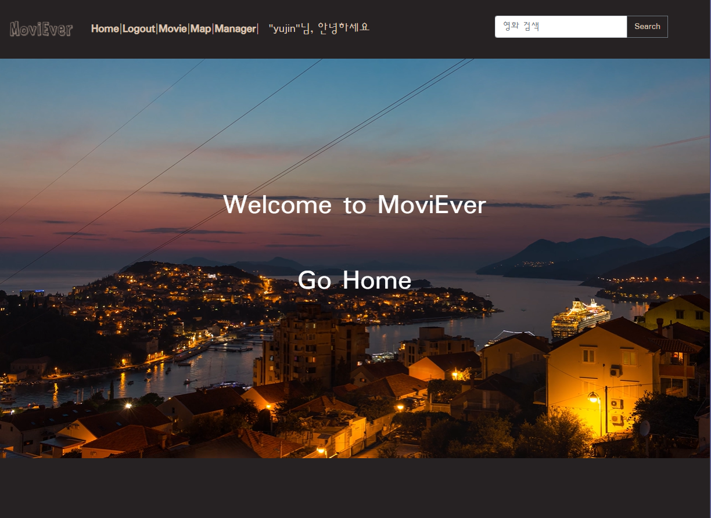

- 처음 주소로 들어갔을 때, mp4 파일이 재생되면서 Go Home을 클릭하면 Home 화면으로 이동

2. Home 화면

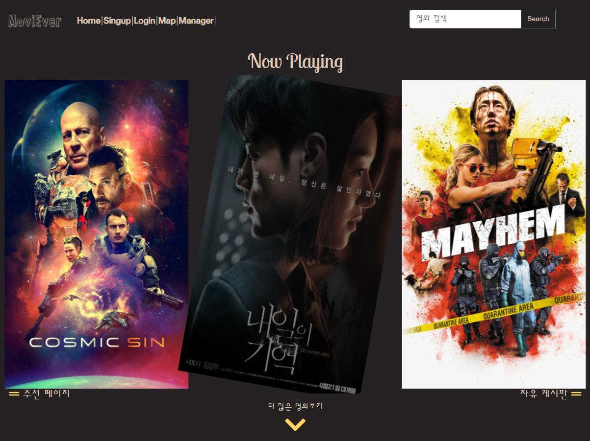

- 네브바

  : Home, 회원가입, 로그인, 지도, 관리자 페이지, search bar로 구성

  : 로그인시, 네브바 로그아웃으로 전환

  : 로그인 시, 로그인한 유저 이름 출력

- 가운데에 현재 상영 영화에 대해 Carousel 이 2초마다 자동으로 돌아가게 설정, 마우스를 올리면 멈추기 기능과 각도 변경 애니메이션 실행

- 왼쪽 구역에 마우스를 올리면 색 전환과 함께, 클릭시 추천 페이지로 이동

- 오른쪽 구역에 마우스를 올리면 색 전환과 함께, 자유 게이판 페이지로 이동

- 아래 화살표 버튼을 클릭 시, 영화 목록 페이지로 이동

3. 로그인, 회원가입 페이지

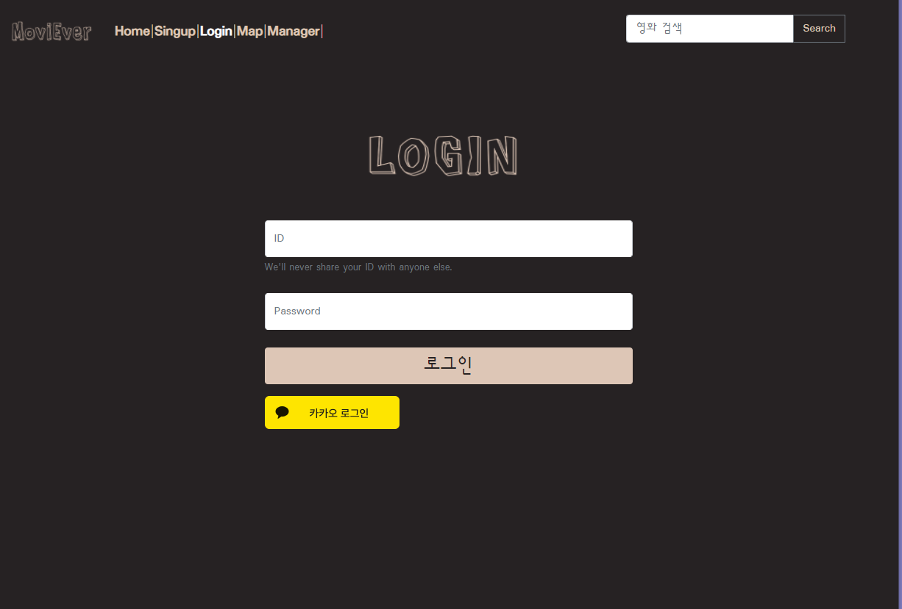 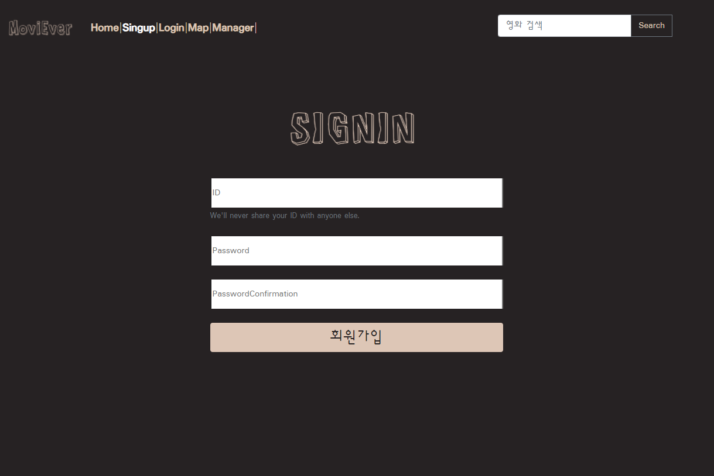

- 로그인 페이지
  : 아이디와 비밀번호를 정상적으로 입력하면 홈화면으로 이동
  : 아이디 또는 비밀번호 오류 시, 경고창 출력
  : 카카오 로그인 버튼 클릭 시, 카카오 로그인 페이지로 이동
- 회원가입 페이지
  : 아이디, 비밀번호, 비밀번호 확인 입력 창 구성
  : 비밀번호와 비밀번호 확인이 일치하지 않을 시, 경고창 출력
  : 회원가입 시, 로그인 화면으로 이동

4. 자유 게시판

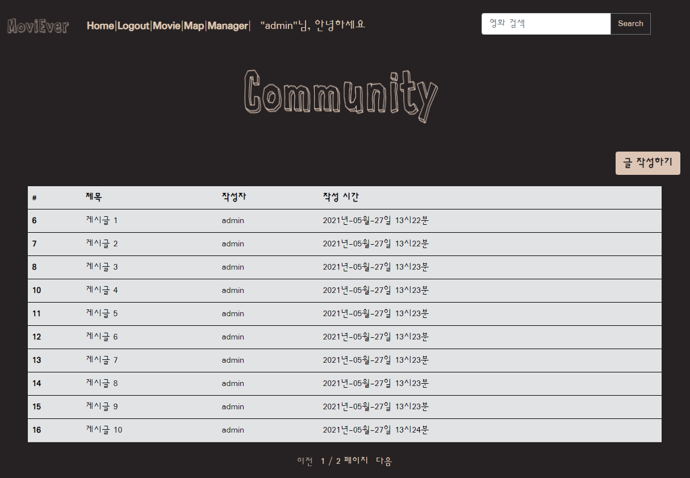 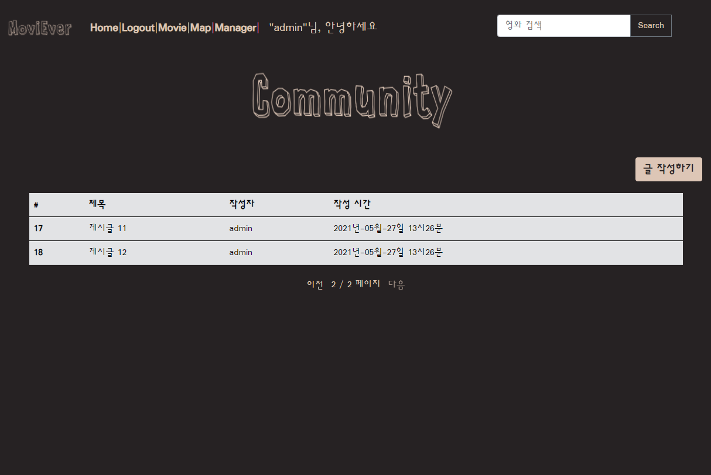

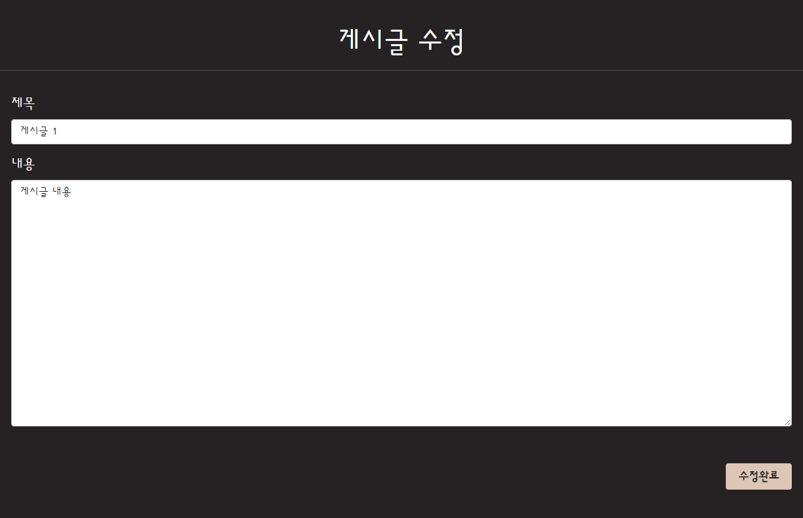 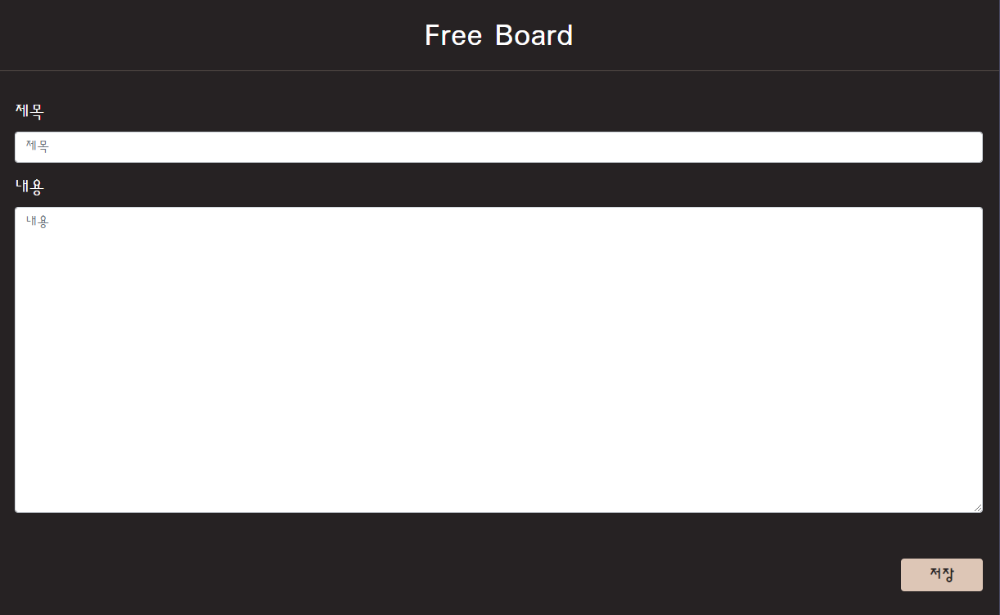 

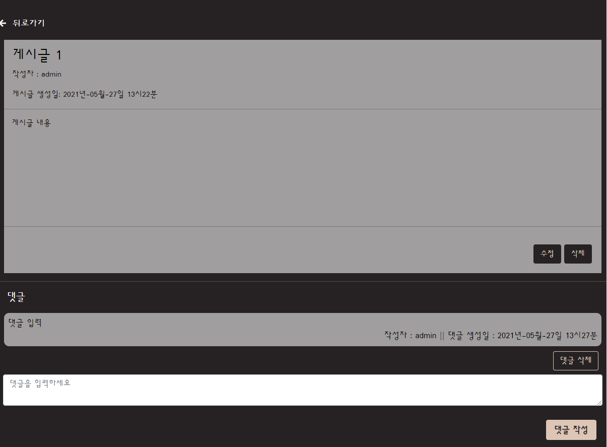 

- 로그아웃 상태일 때, 자유게시판을 클릭하면 로그인이 필요하다는 경고창 출력

- 글 작성하기 버튼 클릭 시, 새로운 게시글 작성 가능

- 게시글 제목, 작성자, 작성시간이 테이블에 표시됨

- 게시글 제목을 클릭시, 게시글 상세 페이지로 이동하며 댓글 입력이 가능

  : 게시글은 작성자만 수정 및 삭제 가능

  : 본인이 아닐 시 경고창 출력

  : 수정 페이지에서는 기존 게시글에 입력된 데이터 출력

  : 뒤로가기 버튼 클릭 시, 게시글 목록으로 이동

- 댓글 내용, 작성자, 작성시간이 표시됨
  : 댓글 작성자만 삭제 가능
  : 본인이 아닐 시 경고창 출력

5. 영화 목록페이지 / 상세 정보 / 영화 필터 / Search Bar

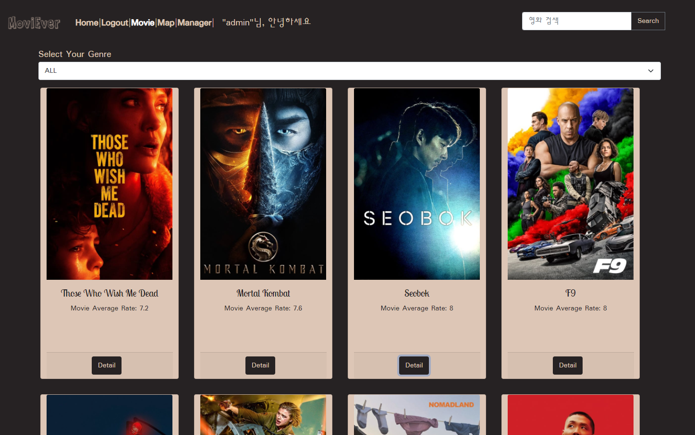  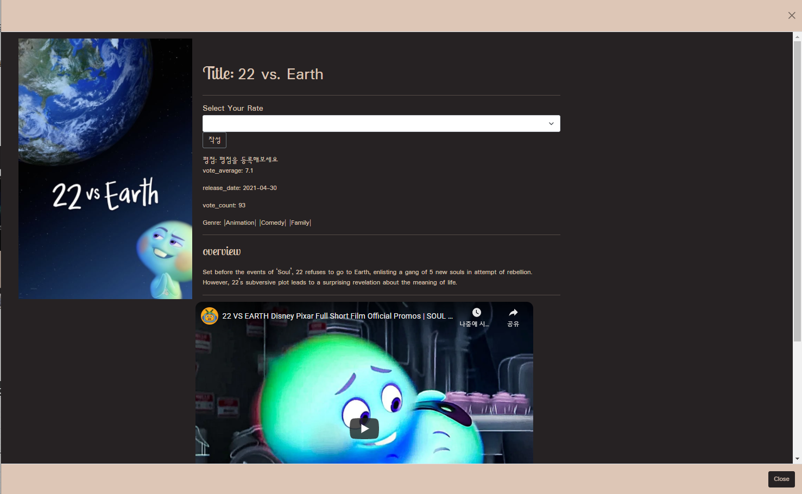  

 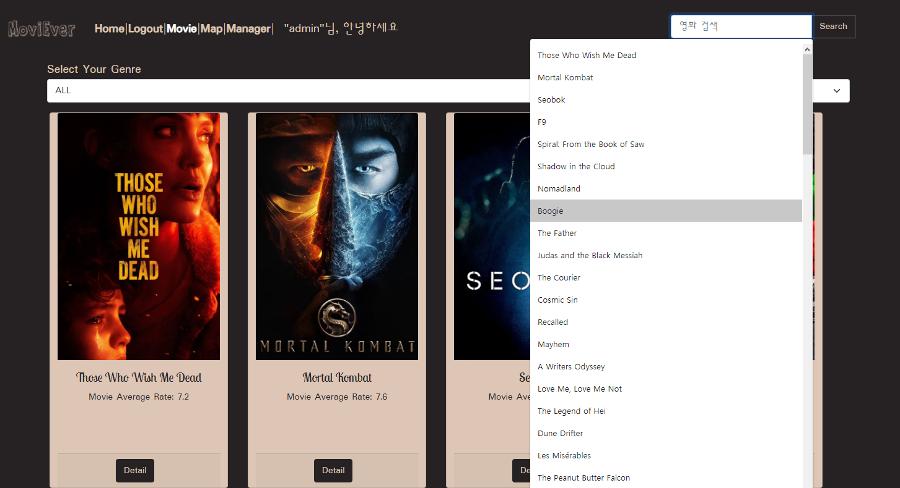 

- 홈화면 하단의 "더 많은 영화보기"  또는 네브바의 "Movie" 를 클릭하면 영화 목록 페이지로 이동

  : 영화 목록페이지는 Detail를 누르면 상세정보 페이지가 출력

- 상세 정보페이지는 포스터, 제목, 평점, 내용 등으로 구성됨

  : 하단으로 이동 시 해당 영화의 트렐일러 영상을 시청 가능

  : 평점 주기 가능, "--기존 평점 삭제--"을 클릭 시 평점 삭제 가능

- 영화 목록 페이지의 select bar를 클릭 시, 장르와 평점을 기준으로 필터 가능

- 네브바의 SearchBar에서 영화를 검색 시, <u>**어느 페이지에서나 📚**</u>  해당 영화 상세 정보 출력

6. 추천 페이지

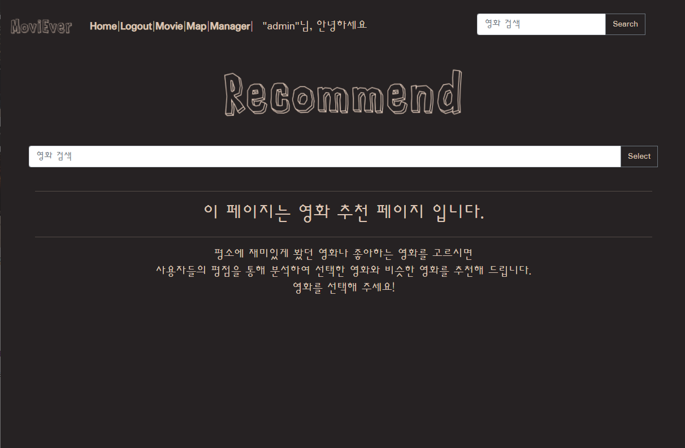 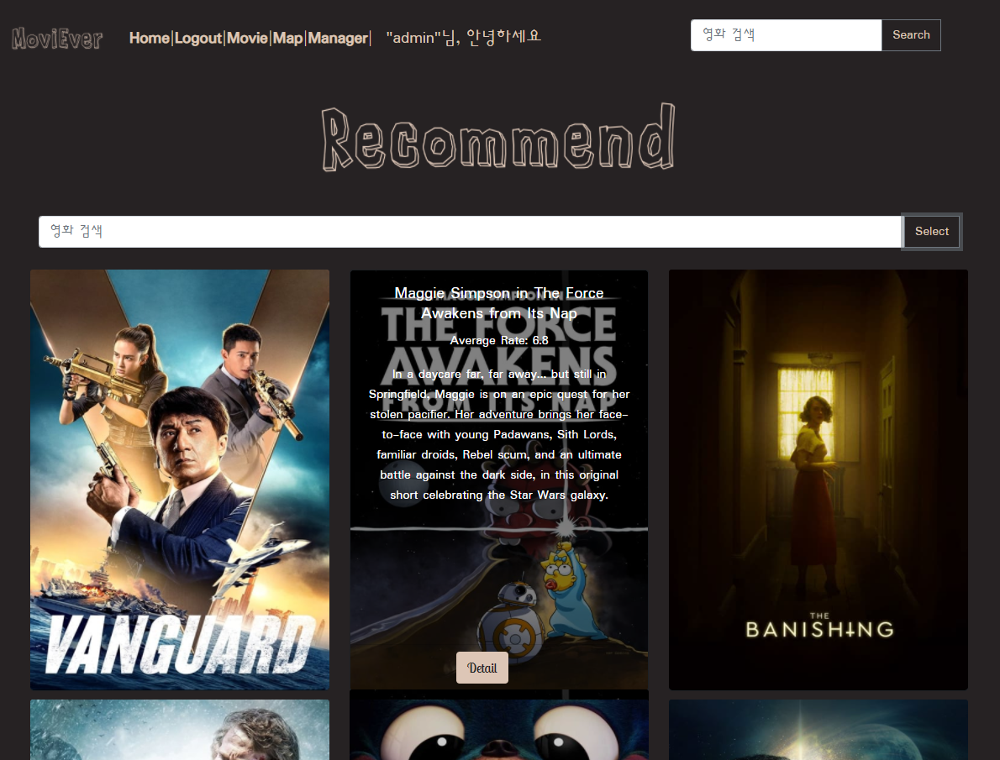

- 로그아웃 상태일 시, 로그인이 필요하다는 경고창 출력

- 영화 추천 알고리즘을 적용

  : Content-based CF 알고리즘을 Rating(사용자 평점) 을 기준으로 적용

  : CF 알고리즘이란, 각 유저들이 등록한 영화평점과 평가한 유저들의 Cosine 유사도를 계산해 특정 영화에 유사한 영화들을 추천해준다.

- 해당 카드에 마우스를 올리면 카드가 아래로 이동하면서, 제목/평점/내용 이 출력됨

  : Detail 버튼을 클릭 시 영화 상세 페이지로 출력

7. 지도 페이지

- 지도 페이지 초기화면은 대전 삼성화재 유성 연수원으로 설정됨
- 카카오 지도 API를 이용해 지도 기능 구현
- 검색을 통해 원하는 지역 검색 가능, 해당 관련 위치들을 왼쪽 상단에 목록으로 표시 (페이지네이션 가능)

8. 관리자 페이지

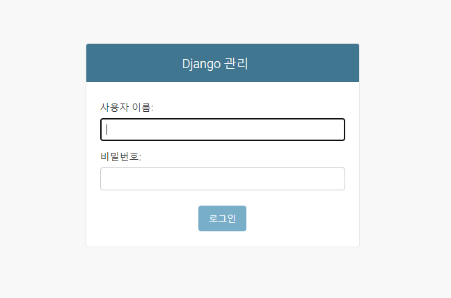 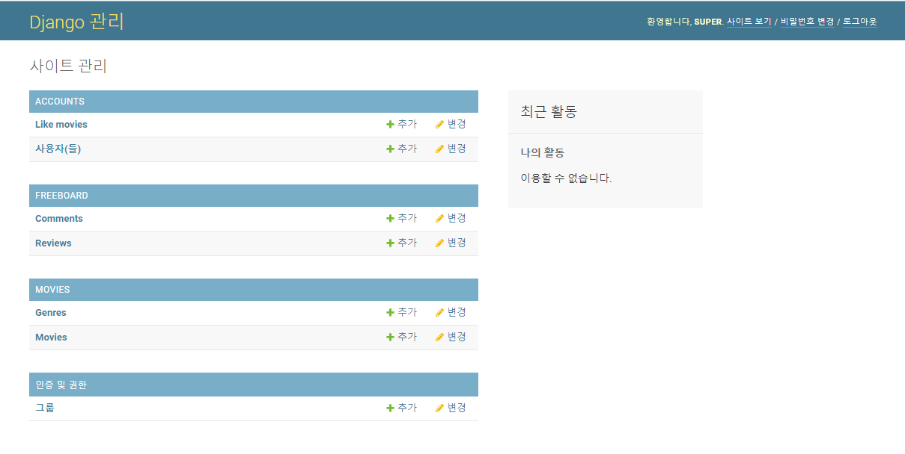

- superuser로 로그인 시, "Manger"를 클릭하면 Django 관리 페이지로 이동

  : 🚫 superuser가 아닐 시, "허가되지 않은 사용자입니다" 경고창 출력

- User, Comments, Reviews, Genres, Moviews, Like movies(평점) 관리 가능

  : model 에`__str__` 를 통해 Genre 의 name 표시, 영화 title 표시 등 사용성 향상

## 4. 데이터베이스 모델링 (ERD)

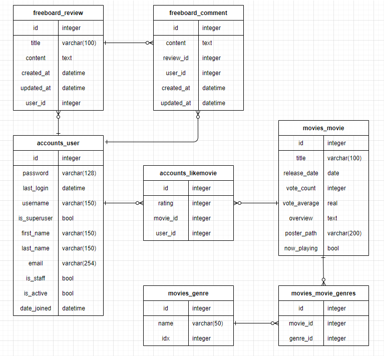

## 5. 느낀점

- 이유진

  > 처음 프로젝트를 시작할 때 페어와의 목표는 자전거부터 차근차근 쌓아나가는 것이었습니다. 그래서 기본적인 기능부터, 비록 디자인이 좋지 않더라도 구현해 나갔습니다. 그렇게 자전거를 만들고 난 후에는 원하는 기능들을 덧붙여 나가면서 자동차로 발전해나가 점점 원하는 웹을 만들어 나갔습니다. 또한, 페어와 처음 시작할 때 노션에 구현해야 될 기능들과 이에 해야될 일들을 체계적으로 나누어 놓았고, 이를 각자 분담해 하나씩 해나갔기에 일주일이라는 길지 않은 시간동안 이만큼의 결과에 다달았던 것 같습니다. 페어와의 의견교류도 잘 이루어져 프로젝트 기간동안 정말 힘들면서도 재밌게 진행했던 것이 이번 프로젝트에서 가장 좋았던 점인 것 같습니다. ssafy 1학기 최종 프로젝트를 재밌게 진행할 수 있도록 도와주고 만족스러운 결과물을 함께 만들어준 페어에게 감사하며...
  >
  > 
  >
  > THE END ... 😎

- 김진규

  >제가 이때까지 해온 개발은 저 혼자하는 개발이었습니다. 팀 프로젝트를 할 때에도 믿고 맡기기 보단 제가 하는게 마음이 편해서 주로 대부분을 맡아 했었습니다. 하지만 이번에 처음으로 믿고 맡길 수 있는 페어를 만나게 되었고 같이 개발을 하게 되었습니다 . 처음에는 과연 우리가 목표한 결과를 만들어 낼 수 있을까? 하는 막연한 걱정이 있었지만, 생각하는 점과 목표가 비슷해서 많은 대화를 통해 진행 방향을 설정하고 역할을 분담하여 개발을 하니 예상보다 빠르게 목표한 기능들을 다 구현해 낼 수 있었고 남은 시간에 추가 기능까지 구현하였습니다. 약 일주일 동안 재밌어서 제대로 쉬지도 않고 붙잡고 있던 프로젝트가 끝나서 시원 섭섭한 기분이 들지만 그동안 해온 고생을 보상 받는 잘 만들어진 결과 덕에 웃으며 프로젝트를 마무리 할 수 있었습니다. 페어 덕분에 같이 하는 개발의 즐거움을 알 수 있었고 제가 SSAFY를 통해 경험해 보고 알고 싶었던 협업이란 이런 것이다! 라는 것을 알게 된 소중한 경험이었습니다. 이런 경험을 할 수 있게 도와주고 잘해준 나의 페어에게 감사하며 SSAFY에서의 1학기를 마칩니다. 다들 정말 감사합니다!